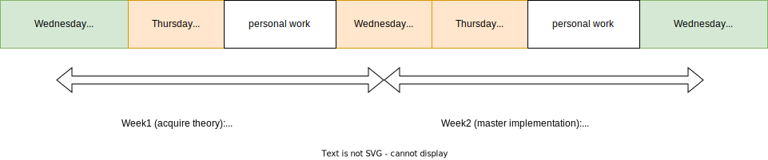

.. _course:

************************************
Organization (UCLouvain Specific)
************************************

Pedagogy
======================================

The pedagogy used is that of `Flipped classroom <https://en.wikipedia.org/wiki/Flipped_classroom>`_. 

Therefore, it is imperative that students work from home:

* read the mentioned chapters of the reference book,
* program regularly by doing the exercises offered on INGInious_
* prepare theoretical questions.

It is important that you **get the reference book as soon as possible**.
There are about twenty for rent in BST.

Agenda
=======================================

The course is organized in 6 modules of 2 weeks. 
Each module spans over two weeks:

Week 1:

* Wednesday 2PM: introduction to the topic with Prof. P. Schaus
* Thursday 8h30 or 16h15: lab session with the TA and tutors (on teams or computer lab)
* Rest of the week: reading of the chapters by the students and preparation of the theoretical exercises A

Week 2:

* Wednesday 2PM: correction of exercises A by TA (Harold Kiossou or Alice Burlats)
* Thursday 8h30 or 16h15: lab session with the TA and tutors (on teams or computer lab)

Week 3:

* Wednesday 2M: Correction of exercises B [+ beginning of next module] with Prof. P. Schaus

Check the `rooms <https://ade-scheduler.info.ucl.ac.be/calendar/#>`_ 

You need to subscribe on `Moodle <https://moodle.uclouvain.be>`_ for the labs and for the communication with the students.

For the students participating on the lab on `Teams <https://teams.microsoft.com/l/team/19%3Ac5uyy7pCrTfE8exSLNuY6MmMsuSkAQyYS4sd8PizuiM1%40thread.tacv2/conversations?groupId=089eaa3e-68ad-41a8-a915-11c26db23d69&tenantId=7ab090d4-fa2e-4ecf-bc7c-4127b4d582ec>`_  , there is a channel for each module.

Make sure you registered on `Moodle <https://moodle.uclouvain.be/course/view.php?id=1049>`_. 

Feel free to ask questions during the two hours of practical work in writing or via a teams call.
Of course, nothing prevents you from asking questions via chat with your tutor outside of the slot provided.
TA will respond to you as they can.

Grading
=======================================

Computer exam on Inginious.
One mid-term quiz will be proposed on two points during smart week. 
It can only impact positively your grade.

Contact and Communication
=======================================

Important communications with students will be via moodle.
For all important communications, you can also write to us by email.
