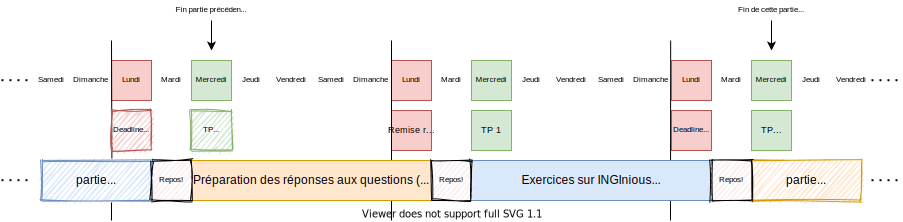

.. _intro:

************************************
Organisation (lisez ceci en premier)
************************************

Le livre de référence utilisé pour ce cours est
`Algorithms <https://algs4.cs.princeton.edu/home/>`_ (4e édition)
de Robert Sedgewick et Kevin Wayne.

Il est important de vous **procurer ce livre le plus rapidement possible**.
**Le livre est disponible au SICI à un prix réduit (à partir du mercredi 16/09)!**.
Il y en a une vingtaine à louer en BST.

Pédagogie
=======================================

La pédagogie utilisée est celle des `classes inversées <https://fr.wikipedia.org/wiki/Classe_inversée>`_. Il n'y
a pas de cours magistraux, seulement des séances de TPs, en groupes fixes, sous supervision d'un tuteur.

Par conséquent, les élèves doivent impérativement travailler chez eux:

* lire les chapitres mentionnés du livre de référence,
* programmer régulièrement en faisant les exercices proposés sur INGInious_
* préparer les questions théoriques en vue d'une discussion avec le tuteur.

Le cours utilise le langage *Java* et plus spécifiquement la version Java8_.
L'IDE recommandé pour ce cours et disponible à l'examen est IntelliJ_.
Nous utiliserons également l'outil Junit4_ pour réaliser des tests unitaires.
Il est fortement recommandé de vous familiariser à ces outils en préparation à l'examen.

Chaque étudiant sera assigné à un groupe de 5 à 7 étudiants, et sera supervisé par un tuteur (qui supervise 4 groupes).
Certains exercices (notamment théoriques) se font en groupe, tandis que d'autres (ceux de programmation) se font individuellement.

.. _Java8: https://docs.oracle.com/javase/8/docs/api.
.. _IntelliJ: https://www.jetbrains.com/idea/
.. _INGInious: https://inginious.info.ucl.ac.be
.. _JUnit4: https://junit.org/junit4/.

Agenda
=======================================

Le cours est organisé en 6 modules de 2 semaines. Chaque module est composé de deux TPs. Dans la mesure du possible, ils se font en présentiel.

Le cours devrait vous prendre environ 5/6h par semaine, dont deux en TP.

Les TPs sont donnés soit le mercredi soit le jeudi, en fonction de ce qui vous est assigné.
Prenons l'exemple d'une semaine typique d'un étudiant ayant son TP le mercredi:

- De **mercredi à lundi** de la semaine avant le TP1:
    - lecture du livre de référence
    - préparation des exercices théoriques **en groupe**
- **Lundi minuit**: soumission du rapport de groupe (par mail au tuteur), répondant aux questions théoriques
- **Mercredi 14h**: TP1
- De **mercredi à lundi** de la semaine suivant le TP1: préparation des exercices individuels sur INGInious
- **Lundi minuit**: deadline pour les exercices INGInious
- **Mercredi 14h**: TP2
- retour au début de la liste pour la partie suivante.

Si vous avez TP le jeudi (à 8h30 ou a 16h15), décalez l'horaire d'une journée.

Evaluation
=======================================

Sur les 20 points de la note finale:

- La participation aux TPs est évaluée sur 4 points. Dans ce total sont intégrées ces différentes facettes:
    - Participation **active** aux TPs, évaluée par le tuteur
    - Remise des tâches INGInious dans les temps (essayer raisonablement est suffisant; vous avez le droit à l'erreur!)
  La participation est prise en compte également pour la session d'Aout.
- L'examen est sur 16 points.
    - Un mid-term est organisé en S7 sur INGInious. L'évaluation mid-term compte pour 10% du total de l'examen,
      uniquement si elle fait remonter la moyenne de l'étudiant. La même pondération est appliquée au mois d'août.
      La matière est celle des partie 1 à 3.
    - L'examen est sur ordinateur.

Pour résumer:

- Soit :math:`p \in [0, 4]` la note de participation (sur 4)
- Soit :math:`e \in [0, 20]` la note de l'examen (sur 20)
- Soit :math:`m \in [0, 20]` la note du midterm (sur 20)

La note finale sur 20 est

.. math::

    p + \frac{16\cdot \max(e, \frac{9e+m}{10})}{20}

Contact et communication
=======================================

Les communications importantes avec les étudiants se feront via moodle et Teams (merci de vous y inscrire!)
Pour toutes communications importantes, vous pouvez également nous écrire par mail.

.. list-table:: Contacts
   :header-rows: 1

   * - Nom
     - Email
     - Rôle
   * - Guillaume Derval
     - `guillaume.derval@uclouvain.be <mailto:guillaume.derval@uclouvain.be>`_
     - Enseignant
   * - Hélène Verhaeghe
     - `helene.verhaeghe@uclouvain.be <mailto:helene.verhaeghe@uclouvain.be>`_
     - Assistante, tutrice groupes 37-40
   * - Alexandre Gobeaux
     - `alexandre.gobeaux@student.uclouvain.be <mailto:alexandre.gobeaux@student.uclouvain.be>`_
     - Tuteur groupe 1-4
   * - Cyril Pletinckx
     - `cyril.pletinckx@student.uclouvain.be <mailto:cyril.pletinckx@student.uclouvain.be>`_
     - Tuteur groupe 5-8
   * - Marine Branders
     - `marine.branders@student.uclouvain.be <mailto:marine.branders@student.uclouvain.be>`_
     - Tutrice groupe 9-12
   * - Aurélien Buchet
     - `aurelien.buchet@student.uclouvain.be <mailto:aurelien.buchet@student.uclouvain.be>`_
     - Tuteur groupe 13-16
   * - Henri Piron
     - `henri.piron@student.uclouvain.be <mailto:henri.piron@student.uclouvain.be>`_
     - Tuteur groupe 17-20
   * - Edgar Gevorgyan
     - `edgar.gevorgyan@student.uclouvain.be <mailto:edgar.gevorgyan@student.uclouvain.be>`_
     - Tuteur groupe 21-24
   * - Louis Navarre
     - `navarre.louis@student.uclouvain.be <mailto:navarre.louis@student.uclouvain.be>`_
     - Tuteur groupe 25-28
   * - Romain Graux
     - `romain.graux@student.uclouvain.be <mailto:romain.graux@student.uclouvain.be>`_
     - Tuteur groupe 29-32
   * - Emeline Christoph
     - `emeline.christoph@student.uclouvain.be <mailto:emeline.christoph@student.uclouvain.be>`_
     - Tutrice groupe 33-36
