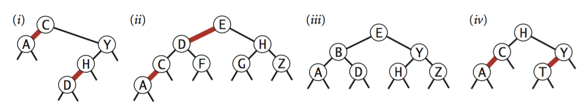

.. _part3:

************************************************************************************************
Partie 3 | Arbres de recherche
************************************************************************************************

Rendez-vous en S5!

Exercices théoriques: première partie
=======================================

.. note::
   Vous devez faire ces exercices pour le lundi de S6.

Exercice 3.1.1
""""""""""""""

Laquelle des deux implémentations `SequentialSearchST` ou `BinarySearchST` utiliseriez vous pour une application
qui réalise :math:`10^3` `put()` et :math:`10^6` `get()` dans un ordre aléatoire? Justifiez.

Exercice 3.1.2
""""""""""""""

Implémentez la méthode `floor()` de `BinarySearchST`.

Exercice 3.1.3
"""""""""""""""

*Exercice 3.1.24 du livre*.

En supposant que les clefs soient des doubles ou des entiers. Écrivez une version de la recherche binaire qui supposant
une répartition uniforme des clefs va d'abord chercher au début d'un dictionnaire un mot qui commence par une lettre
proche du début d'alphabet.

Plus exactement, si la clef recherchée est :math:`k_x`, et que la plus petite clef est :math:`k_{lo}` et la plus grande
est :math:`k_{hi}`, cherchez d'abord au pourcentile :math:`\lfloor(k_x-k_{lo})/(k_{hi}-k_{lo}) \rfloor * 100` du tableau
et pas au milieu (pourcentile 50) du tableau d'abord.

Implémentez `InterpolationSearchST` et comparez celle-ci sur `FrequencyCounter`.

Exercice 3.1.4
"""""""""""""""

*Exercice 3.1.25 du livre*.

Il est très fréquent de tester d'abord la présence d'une clef avant d'ajouter ou modifier l'entrée correspondante. Cela
engendre successivement plusieurs recherches consécutives de la même clef.

L'idée du *caching* est de mémoriser en interne la dernière clef accédée
et de l'utiliser de manière opportuniste si celle-ci est toujours valide.
Modifiez `BinarySearchST` pour y intégrer cette idée.

Exercice 3.1.5
""""""""""""""

*Exercice 3.2.31 du livre*.

Écrivez une méthode `isBST()` qui prend un `Node` comme argument et qui retourne `true` si l'argument est est la racine
d'un BST, `false` sinon (il faut donc vérifier que les propriétés d'un BST sont satisfaites).

Est-ce que vérifier (localement) si pour chaque noeud la propriété *"le fils gauche a une clef inférieure et le fils
droit une clef supérieure"* est suffisant? Si non donnez un contre-exemple.

Quelle est la complexité de votre algorithme ?

Exercice 3.1.6
""""""""""""""

*Exercice 3.2.4 du livre*.

Supposons qu'un certain arbre de recherche possède des clefs entre 1 et 10 et que nous cherchions la clef 5.
Quelle(s) séquence(s) ne peut pas correspondre à la séquence des clefs examinées?

* 10,9,8,7,6,5
* 4,10,8,6,5
* 1,10,2,9,3,8,4,7,6,5
* 2,7,3,8,4,5
* 1,2,10,4,8,5

Exercice 3.1.7
""""""""""""""

*Exercice 3.3.33 du livre*.

Écrivez une méthode `is23()` dans `RedBlackBST` qui vérifient respectivement qu'aucun noeud n'est connecté
à deux liens rouges et qu'il n'y a pas de lien rouge vers la droite.
Écrivez aussi une méthode `isBalanced()` qui vérifie que tout chemin depuis la racine vers vers un lien null a le
même nombre de liens noirs. Finalement combinez `isBST(),is23()` et `isBalanced()` pour implémenter `isRedBlackBST()`.

Exercice 3.1.8
""""""""""""""

Comment faire pour énumérer en ordre croissant toutes les clés mémorisées
dans un arbre binaire de recherche ? Quelle est la complexité temporelle de
cette opération ? Justifiez votre réponse.

Exercice 3.1.9
""""""""""""""

Partant d'un arbre binaire de recherche initialement vide, comment se présente l'arbre
après y avoir inséré les clés 12, 5, 10, 3, 13, 14, 15, 17, 18, 15 ? Pour les mêmes données comment se présenterait
l'arbre finalement obtenu s'il s'agissait d'un 2-3 arbre ?

Cet exemple illustre-t-il les avantages ou inconvénients de ces différentes structures de données ? Pourquoi ?

Exercice 3.1.10
"""""""""""""""

Lequel ou lesquels de ces arbres est(sont) red-black? Pour chacun, dessiner la correspondance vers un 2-3 tree
(décrite p432).

Exercices d'implémentation sur Inginious
==========================================

.. note::
   Vous devez faire ces exercices pour le lundi de S7.

Les exercices seront publiés le lundi de S6.

Exercices théorique: deuxième partie
=======================================

.. note::
   Vous devez faire ces exercices pour le lundi de S7.

Les exercices seront publiés le lundi de S6.