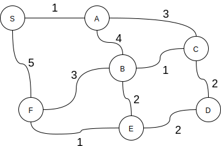

.. _part6_ex2:

Exercises B
=======================================

.. note::
    You must complete these exercises by Wednesday of W13.

Exercise 6.2.2 (Dijkstra revisited)
"""""""""""""""""""""""""""""""""""""""""""""

We are interested in the implementation of the Dijkstra algorithm p655.

* What is the time complexity of this algorithm.
* Rewrite this algorithm using only auxiliary collections from *java.util*.  So we have to get rid of *IndexMinPQ* and replace this structure by something else from *java.util*.

Exercise 6.2.3 (string of fairy lights)
"""""""""""""""""""""""""""""""""""""""""""""

The INGI department has acquired a very nice string of fairy lights for Christmas to decorate the Réaumur building.
It has the structure of a graph with a lamp on each node.
When the tinsel is turned on, a lamp is randomly turned on and then every second, all the lamps directly connected (on adjacent nodes) are turned on in turn.
Implement the "minTime" method answering the following question:
*At the end of how many seconds* **at the very least** *could our garland be completely lit?*

Voici la signature de la méthode:

.. code-block:: java

  public int minTime(Graph G);

You can assume that you have the Graph structure API as described in the book.
We assume that the graph G is connected.

* What is the time complexity of your algorithm?

Exercise 6.2.4 (Maximization of minimum weight)
"""""""""""""""""""""""""""""""""""""""""""""""""

Let G be a undirected and positively weighted graph.
Given an origin S, we want to find a path to each node that maximizes *the minimum edge weight on this path*.

For example, in this graph, S-F-B-A-C-D is such a path with 2 as the minimum edge point.

Can you adapt an algorithm seen in class to find such paths to each node?

Hint: look at the properties of the weights. Is it comparable to shortest paths?

Exercise 6.2.5 (Inginious)
""""""""""""""""""""""""""""

A programming exercise on shortest path with implicit graphs:
`MineClimbing <https://inginious.info.ucl.ac.be/course/LINFO1121/graphs_MineClimbing>`_

Exercise 6.2.6 (Inginious)
""""""""""""""""""""""""""""

A challenging path problem in a public transport network:
`Trains <https://inginious.info.ucl.ac.be/course/LINFO1121/graphs_Trains>`_

Exercise 6.2.7 (Inginious)
""""""""""""""""""""""""""""

A string transformation problem viewed as path problem on a graph:
`Words <https://inginious.info.ucl.ac.be/course/LINFO1121/graphs_WordTransformationSP>`_

Exercise 6.2.8 (Inginious)
""""""""""""""""""""""""""""

Help the humanity to discover a new habitable galaxy by solving a hyperspace shortest
space: `GalaxyPath <https://inginious.info.ucl.ac.be/course/LINFO1121/graphs_GalaxyPath>`_

