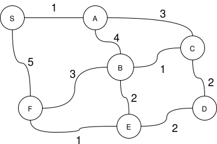

.. _part6_ex2:

Exercises B
=======================================

.. note::
    You must complete these exercises by Wednesday of W13.

Exercise 6.2.2 (Dijkstra Revisited)
""""""""""""""""""""""""""""""""""""""""""""""""""

We are interested in the implementation of Dijkstra's algorithm on page 655.

* What is the time complexity of this algorithm?
* Rewrite this algorithm using only auxiliary collections from ``java.util``. Specifically, replace ``IndexMinPQ`` with a standard collection from ``java.util``.

Exercise 6.2.3 (String of Fairy Lights)
""""""""""""""""""""""""""""""""""""""""""""""""""

The INGI department has acquired a string of fairy lights for Christmas to decorate the Réaumur building.
The lights form a graph with a lamp at each vertex.
When turned on, an initial lamp is chosen at random, and every second thereafter, all lamps adjacent to currently lit lamps are switched on in turn.
Implement the ``minTime`` method answering the following question:
*What is the minimum number of seconds required for the entire string of lights to be fully illuminated, given an optimal starting lamp?*

Here is the method signature:

.. code-block:: java

  public int minTime(Graph G);

You may assume the ``Graph`` API as described in the textbook.
Assume that the graph :math:`G` is connected.

* What is the time complexity of your algorithm?

Exercise 6.2.4 (Maximizing the Minimum Edge Weight)
""""""""""""""""""""""""""""""""""""""""""""""""""""""""""""

Let :math:`G` be an undirected graph with positive edge weights.
Given a source vertex :math:`S`, we want to find a path to each vertex that maximizes *the minimum edge weight on that path*.

For example, in this graph, :math:`S-F-B-A-C-D` is such a path, with a bottleneck edge weight of 2.

Can you adapt an algorithm seen in class to find such paths to each vertex?

Hint: Consider the properties of the weights. How does this compare to shortest path algorithms (or MST algorithms)?

Exercise 6.2.5 (INGInious)
""""""""""""""""""""""""""

A programming exercise on shortest paths with implicit graphs (exam 2018):
`MineClimbing <https://inginious.info.ucl.ac.be/course/LINFO1121/graphs_MineClimbing>`_

Exercise 6.2.6 (INGInious)
""""""""""""""""""""""""""

A challenging shortest-path problem in a public transport network (exam 2019):
`Trains <https://inginious.info.ucl.ac.be/course/LINFO1121/graphs_Trains>`_

Exercise 6.2.7 (INGInious)
""""""""""""""""""""""""""

A string transformation problem modeled as a shortest-path problem on a graph:
`Words <https://inginious.info.ucl.ac.be/course/LINFO1121/graphs_WordTransformationSP>`_

Exercise 6.2.8 (INGInious)
""""""""""""""""""""""""""

Help humanity discover a new habitable galaxy by solving a hyperspace shortest-path problem (exam 2021):
`GalaxyPath <https://inginious.info.ucl.ac.be/course/LINFO1121/graphs_GalaxyPath>`_

Exercise 6.2.9 (INGInious)
""""""""""""""""""""""""""

A topological sorting problem to verify whether a course programme complies with university prerequisite constraints (exam 2022):
`TaskScheduler <https://inginious.info.ucl.ac.be/course/LINFO1121/graphs_TaskScheduler>`_

Exercise 6.2.10 (INGInious)
"""""""""""""""""""""""""""

Help Olympic organizers plan efficient evacuation routes:
`Evacuation <https://inginious.info.ucl.ac.be/course/LINFO1121/graphs_Evacuation>`_

Exercise 6.2.11 (INGInious)
"""""""""""""""""""""""""""

Help firefighters model the spread of a forest fire (exam 2022):
`Wildfire <https://inginious.info.ucl.ac.be/course/LINFO1121/graphs_Wildfire>`_

