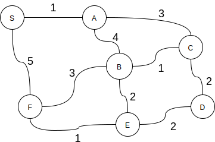

.. _part6_2:

.. rubric:: Partie 6 | Graphes: parcours, arbres sous-tendants, et plus courts chemins

*************************************************************************************************
Partie 6: Questions supplémentaires
*************************************************************************************************

Exercice 6.2.1 (Labyrinthe.)
"""""""""""""""""""""""""""""""""""""""""""""

On s'intéresse à la résolution d'un labyrinthe représenté sous la forme d'une matrice binaire :math:`n \times m`.
Cette matrice n'est rien d'autre q'un tableau à deux dimensions de booleans.
Une position égale à *true* signifie que celle-ci est disponible, alors que *false*
indique qu'il y a un mur et que vous ne pouvez transiter par cette position.
Ecrivez un fragment de code Java (classes, méthodes, etc.) pour trouver **le plus court chemin**
entre deux coordonnées *(x1,y1)* et *(x2,y2)* supposées disponibles,
Les déplacements ne peuvent se faire qu'horizontalement ou verticalement et d'une seule position à la fois.
Votre résultat doit être retourné sous la forme d'un iterable de coordonnées depuis l'origine vers la destination.
Les coordonnées sont représentées par des entiers compris entre :math:`0` et :math:`n\cdot m-1`.
L'entier :math:`a` représente la coordonnée :math:`(a/m,a \% m)`.
La signature de votre méthode est donc:

.. code-block:: java

	Iterable<Integer> shortestPath(boolean[][] maze, int x1, int y1, int x2, int y2);

Questions préliminaires:

* Quel algorithme permet de trouver le plus court chemin entre deux noeuds sur un graphe sans poids ?
* Est-ce qu'une structure de données de type Graph est nécessaire pour implémenter votre algorithme ? Si oui laquelle ? Si non pourquoi ?
* Quelle est la complexité de votre algorithme worst/best case ?

Exercice 6.2.2 (Dijkstra revisité)
"""""""""""""""""""""""""""""""""""""""""""""

On s’intéresse à l’implémentation de l’algorithme de Dijkstra p655.

* Quelle est la complexité de cet algorithme.
* Réécrivez cet algorithme en utilisant uniquement des collections auxiliaires issues de *java.util*.  Il faut donc se débarrasser de *IndexMinPQ* et remplacer cette structure par autre chose issu de *java.util*.

Exercice 6.2.3 (La Guirlande de Noël INGI)
"""""""""""""""""""""""""""""""""""""""""""""

Le département INGI s’est doté d’une très jolie guirlande de Noël pour décorer le Réaumur.
Celle-ci a la structure d’un graphe avec une lampe sur chaque noeud.
Lorsqu’on allume la guirlande, une lampe s’allume au hasard et puis chaque seconde, toutes les lampes directement reliées (sur les noeuds adjacents) s’allument à leur tour.
Implémentez la méthode « minTime » répondant à la question suivante:
*Au bout de combien de secondes* **au minimum** *notre guirlande pourrait-elle être complètement allumée ?*

Voici la signature de la méthode:

.. code-block:: java

	public int minTime(Graph G);

Vous pouvez supposer que vous disposez de l’API de la structure Graph telle que décrite dans le livre.
On suppose que le graph G est connexe.

* Quelle est la complexité temporelle de votre algorithme ?

Exercice 6.2.4 (Maximisation de poids minimum)
"""""""""""""""""""""""""""""""""""""""""""""""""

Soit un graphe G dirigé et pondéré positivement.
Etant donné une origine S, on veut trouver un chemin vers chaque noeud qui maximise *le poids de l'arête minimum sur ce chemin*.

Par exemple, dans ce graphe, S-F-B-A-C-D  est un tel chemin avec 2 comme étant le point de l'arête minimum.

Pouvez-vous adapter un algorithme vu au cours pour trouver de tels chemins vers chaque noeud ?

Hint: regardez aux propriétés des poids. Est-ce comparable aux plus courts chemins ?